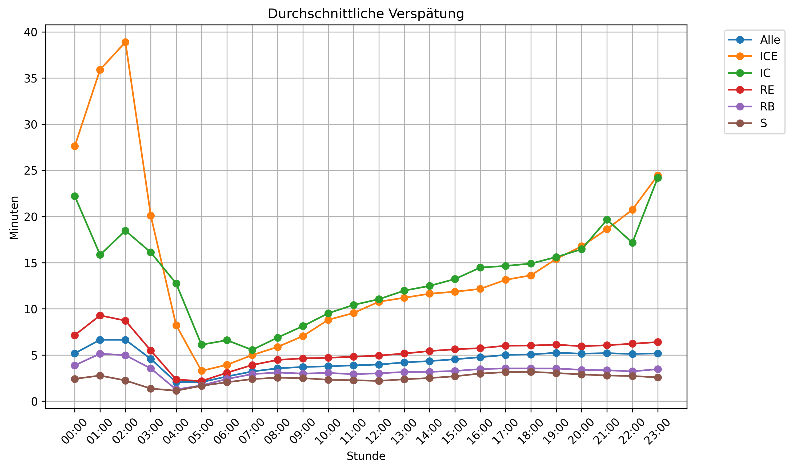

# Deutsche Bahn Data

This project saves public historical data from "Deutsche Bahn", the biggest german train company and makes it [accessible](https://huggingface.co/datasets/piebro/deutsche-bahn-data) for everyone to use.
It includes train schedules, delays, and cancellations from stations across Germany.

There is also a small website to show same stat about the Deutsche Bahn: [piebro.github.io/deutsche-bahn-data](https://piebro.github.io/deutsche-bahn-data/stats/allgemein.html)

The data can be used to validate the [official statistics](https://www.deutschebahn.com/de/konzern/konzernprofil/zahlen_fakten/puenktlichkeitswerte-6878476) and to create many other statistics.



## About the data

Four times a day an automatic job is started that calls the [Station Data API](https://developers.deutschebahn.com/db-api-marketplace/apis/product/stada) to get all stations. Then the [Timetables API](https://developers.deutschebahn.com/db-api-marketplace/apis/product/timetables) is called to get the planned train stops for each station for each hour and the current delays for each station, reaching back longer than 6 hours.

The data is licensed as [(CC BY 4.0)](https://creativecommons.org/licenses/by/4.0/) by Deutsche Bahn.

The data is available as raw_data (basically the raw return of all the queries) and the monthly process data, which get automatically published each month and makes the raw data more usable. The data can be downloaded from huggingface here: https://huggingface.co/datasets/piebro/deutsche-bahn-data

Data of the biggest ~100 stations is available from 2024-07 to 2025-11-02 and since then until now for all stations.

## Using the data

You can download the data from huggingface manually or use the following cmds to download it (these are only tested on Linux, but should also work on mac and windows):

```bash
# Install uv, e.g. for Linux:
curl -LsSf https://astral.sh/uv/install.sh | sh
# Download the monthly releases:
uv run --with "huggingface-hub" hf download piebro/deutsche-bahn-data --repo-type=dataset --local-dir=. --include "monthly_processed_data/*"
# Download all data:
uv run --with "huggingface-hub" hf download piebro/deutsche-bahn-data --repo-type=dataset --local-dir=.
```

Once the parquet files are downloaded you can use your favorite language and framework to work with the data.

### Monthly Release Data Schema

The monthly processed data contains the following columns:

| Column | Type | Description |
|--------|------|-------------|
| `station_name` | string | Name of the station |
| `xml_station_name` | string | Station name from the XML response |
| `eva` | string | EVA station number (unique identifier) |
| `train_name` | string | Name of the train (e.g., "ICE 123", "RE 5") |
| `final_destination_station` | string | Final destination of the train |
| `delay_in_min` | integer | Delay in minutes |
| `time` | timestamp | Actual arrival or departure time |
| `is_canceled` | boolean | Whether the train stop was canceled |
| `train_type` | string | Type of train (e.g., "ICE", "IC", "RE") |
| `train_line_ride_id` | string | Unique identifier for the train ride |
| `train_line_station_num` | integer | Station number in the train's route |
| `arrival_planned_time` | timestamp | Planned arrival time |
| `arrival_change_time` | timestamp | Actual/changed arrival time |
| `departure_planned_time` | timestamp | Planned departure time |
| `departure_change_time` | timestamp | Actual/changed departure time |
| `id` | string | Unique identifier for the train stop |

### Raw Data Schema

The raw data contains the API responses in the following structure:

| Column | Type | Description |
|--------|------|-------------|
| `timestamp` | timestamp | When the API request was made |
| `url` | string | The API endpoint URL that was queried |
| `api_name` | string | Name of the API (e.g., "timetables/v1/plan", "timetables/v1/fchg") |
| `query_params` | string | JSON string of query parameters used |
| `response_data` | string | Raw XML or JSON response from the API |
| `status_code` | string | HTTP status code of the response |
| `error` | string | Error message if the request failed |
| `duration_ms` | float | Request duration in milliseconds |
| `year` | integer | Year of the request (partition key) |
| `month` | integer | Month of the request (partition key) |
| `day` | integer | Day of the request (partition key) |

## Developing Setup

Install uv and git and run the following commands to download the code and setup everything.

```bash
git clone https://github.com/piebro/deutsche-bahn-data.git
cd deutsche-bahn-data
uv sync --python 3.13
uv run pre-commit install
```

## Generating HTML from Notebooks

```bash
uv run python notebooks/src/nb_to_html.py                 # Convert all notebooks (no execution)
uv run python notebooks/src/nb_to_html.py --run           # Run and convert all notebooks
uv run python notebooks/src/nb_to_html.py --run allgemein # Run only allgemein, convert all
```

## Contributing

Contributions are welcome. Open an Issue if you want to report a bug, have an idea or want to propose a change.

## Related Deutsche Bahn and Open Data Websites

There are a few other projects that look at similar data.
- [Video](https://www.youtube.com/watch?v=0rb9CfOvojk): BahnMining - Pünktlichkeit ist eine Zier (David Kriesel) [2019]
- [www.deutschebahn.com](https://www.deutschebahn.com/de/konzern/konzernprofil/zahlen_fakten/puenktlichkeitswerte-6878476#): official statistics from Deutsche Bahn
- [bahn.expert](https://bahn.expert): look at the departure monitor of train stations in real time
- [next.bahnvorhersage.de](https://next.bahnvorhersage.de): a tool to calculate the probability that a train connection works using historical data
- [www.zugfinder.net](https://www.zugfinder.net/de/start): multiple maps of current train positions and statistics for long-distance trains in Germany, Austria, BeNeLux, Denmark, Italy and Slovenia
- [strecken-info.de](https://strecken-info.de/): a map of the German railroads with current construction sites and disruptions on the routes
- [openrailwaymap.org](https://openrailwaymap.org/): a worldwide map with railway infrastructure using OpenStreetMap Data
- [zugspaet.de](https://zugspaet.de): a website, where you can then enter your train and see how often it was late or on time in the past

## License

All code in this project is licensed under the MIT License. The [data](https://huggingface.co/datasets/piebro/deutsche-bahn-data) is licensed under [Attribution 4.0 International (CC BY 4.0)](https://creativecommons.org/licenses/by/4.0/) by Deutsche Bahn.

## Disclaimer

This website is developed by Piet Brömmel. It has no affiliation with Deutsche Bahn or any other transportation company. This website is my personal project and everything stated here is provided without warranty, but is maintained by me to the best of my ability.

## Acknowledgments

Data sourced from Deutsche Bahn's public APIs. Special thanks to Deutsche Bahn for providing open access to this data.