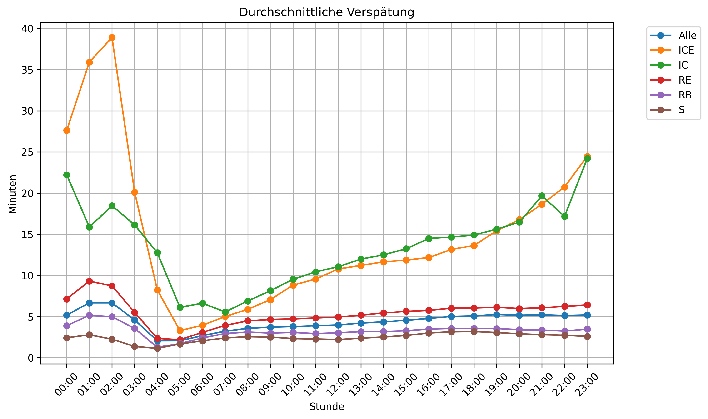

# Deutsche Bahn Data

This project saves public historical data from "Deutsche Bahn", the biggest german train company and makes it [accessible](https://huggingface.co/datasets/piebro/deutsche-bahn-data) for everyone to use.
It includes train schedules, delays, and cancellations from stations across Germany.

There is also a small website to show same stat about the Deutsche Bahn: [piebro.github.io/deutsche-bahn-data](https://piebro.github.io/deutsche-bahn-data/stats/allgemein.html)

The data can be used to validate the [official statistics](https://www.deutschebahn.com/de/konzern/konzernprofil/zahlen_fakten/puenktlichkeitswerte-6878476) and to create many other statistics.



## About the data

Four times a day an automatic job is started that calls the [Station Data API](https://developers.deutschebahn.com/db-api-marketplace/apis/product/stada) to get all stations. Then the [Timetables API](https://developers.deutschebahn.com/db-api-marketplace/apis/product/timetables) is called to get the planned train stops for each station for each hour and the current delays for each station, reaching back longer than 6 hours.

The data is licensed as [(CC BY 4.0)](https://creativecommons.org/licenses/by/4.0/) by Deutsche Bahn.

The data is available as raw_data (basically the raw return of all the queries) and the monthly process data, which get automatically published each month and makes the raw data more usable. The data can be downloaded from huggingface here: https://huggingface.co/datasets/piebro/deutsche-bahn-data

Data of the biggest ~100 stations is available from 2024-07 to 2025-11-02 and since then until now for all stations.

All timestamps in the dataset (both raw and monthly processed) are in German local time (Europe/Berlin, i.e. CET/CEST) as returned by the Deutsche Bahn Timetables API. No timezone conversion is applied during processing.

## Changelog

- **2026-09**: Added non-scheduled stops and replacement trains to the monthly data, plus three new columns: `is_additional_stop`, `is_replacement_train` and `replaced_train_number`. Previously the processed data only contained stops from the planned timetable, so extra stops (e.g. from diversions, marked `ps="a"` by the API) and replacement trains (a different train number running instead of a scheduled one, marked `t="e"` / linked via `<ref>`) were dropped entirely. They are now kept as their own rows, with the new columns making them easy to recognize. `replaced_train_number` links a replacement train back to the train it replaced. The raw data has contained this information since collection began, so all historical monthly files were reprocessed and the new columns are present in all data from 2024-07 onwards. Note that this slightly changes delay/cancellation statistics, because replacement trains and extra stops were previously counted as (partially) cancelled.

- **2026-08**: Replaced the combined `is_canceled` column with `arrival_is_canceled` and `departure_is_canceled`. All historical monthly files are reprocessed with the new schema. The `is_canceled` column can easily be added again in scripts with `df["is_canceled"] = df["arrival_is_canceled"] | df["departure_is_canceled"]`.

- **2026-07**: Some hours of data might be missing. The fetch job runs as a scheduled GitHub Actions cron job, and these runs can be delayed (or occasionally skipped) by GitHub, which in some cases caused an hour to be skipped or fetched twice. The fetch logic was updated to snap each run to a fixed 6-hour block so it is robust against scheduling delays going forward.

- **2026-05**: The `train_name` column was split into two raw columns: `train_number` (the Zugnummer / `tl.n`, identifying a specific train run) and `line_number` (the Liniennummer / `ar.l`/`dp.l`, identifying the route; null for long-distance trains). To get the old `train_name` label (e.g. `"ICE 123"`), combine `train_type` and `train_number`. All historical monthly files were reprocessed with the new schema.

- **2026-05**: the git history was rewritten to remove large data files (`data/` and `monthly_data_releases/`) that had bloated the repository to ~5.7 GB and made it hard to work with. The data is now published on [HuggingFace](https://huggingface.co/datasets/piebro/deutsche-bahn-data).


## Missing data

There were some API errors between 2025-11 and 2026-07 resulting in some missing data for some hours of the day. This issue should be fixed now. The missing data per month:

- 2025-11: 6 hours
- 2026-02: 7 hours
- 2026-03: 10 hours
- 2026-04: 34 hours
- 2026-05: 31 hours
- 2026-06: 6 hours
- 2026-07: 102 hours

## Using the data

You can download the data from huggingface manually or use the following cmds to download it (these are only tested on Linux, but should also work on mac and windows):

```bash
# Install uv, e.g. for Linux:
curl -LsSf https://astral.sh/uv/install.sh | sh
# Download the monthly releases:
uv run --with "huggingface-hub" hf download piebro/deutsche-bahn-data --repo-type=dataset --local-dir=. --include "monthly_processed_data/*"
# Download all data:
uv run --with "huggingface-hub" hf download piebro/deutsche-bahn-data --repo-type=dataset --local-dir=.
```

Once the parquet files are downloaded you can use your favorite language and framework to work with the data.

### Monthly Release Data Schema

The monthly processed data contains the following columns:

| Column | Type | Description |
|--------|------|-------------|
| `station_name` | string | Name of the station |
| `xml_station_name` | string | Station name from the XML response |
| `eva` | string | EVA station number (unique identifier) |
| `train_number` | string | Train number / Zugnummer, the raw `tl.n` value identifying a specific train run (e.g., "123", "12603"). Combine with `train_type` for a label like "ICE 123" |
| `line_number` | string | Line number / Liniennummer, the raw `ar.l`/`dp.l` value identifying the route, non-unique (e.g., "RB23", "14"); null for long-distance trains (ICE/IC/EC) where the API provides no line |
| `final_destination_station` | string | Final destination of the train |
| `delay_in_min` | integer | Delay in minutes |
| `time` | timestamp | Actual arrival or departure time |
| `arrival_is_canceled` | boolean | Whether the arrival at the train stop was canceled |
| `departure_is_canceled` | boolean | Whether the departure from the train stop was canceled |
| `train_type` | string | Type of train (e.g., "ICE", "IC", "RE") |
| `is_additional_stop` | boolean | Whether the stop is not on the scheduled path (e.g. from a diversion) and therefore only present in the change data |
| `is_replacement_train` | boolean | Whether the train replaces a scheduled train run under a different train number |
| `replaced_train_number` | string | Train number of the scheduled train that this stop replaces (null if not a replacement train) |
| `train_line_ride_id` | string | Unique identifier for the train ride |
| `train_line_station_num` | integer | Station number in the train's route |
| `arrival_planned_time` | timestamp | Planned arrival time |
| `arrival_change_time` | timestamp | Actual/changed arrival time |
| `departure_planned_time` | timestamp | Planned departure time |
| `departure_change_time` | timestamp | Actual/changed departure time |
| `id` | string | Unique identifier for the train stop |

### Raw Data Schema

The raw data contains the API responses in the following structure:

| Column | Type | Description |
|--------|------|-------------|
| `timestamp` | timestamp | When the API request was made |
| `url` | string | The API endpoint URL that was queried |
| `api_name` | string | Name of the API (e.g., "timetables/v1/plan", "timetables/v1/fchg") |
| `query_params` | string | JSON string of query parameters used |
| `response_data` | string | Raw XML or JSON response from the API |
| `status_code` | string | HTTP status code of the response |
| `error` | string | Error message if the request failed |
| `duration_ms` | float | Request duration in milliseconds |
| `year` | integer | Year of the request (partition key) |
| `month` | integer | Month of the request (partition key) |
| `day` | integer | Day of the request (partition key) |


## Developing Setup

Install uv and git and run the following commands to download the code and setup everything.

```bash
git clone https://github.com/piebro/deutsche-bahn-data.git
cd deutsche-bahn-data
uv sync --python 3.13
uv run pre-commit install
```

## Generating HTML from Notebooks

```bash
uv run python notebooks/src/nb_to_html.py                 # Convert all notebooks (no execution)
uv run python notebooks/src/nb_to_html.py --run           # Run and convert all notebooks
uv run python notebooks/src/nb_to_html.py --run allgemein # Run only allgemein, convert all
```

## Contributing

Contributions are welcome. Open an Issue if you want to report a bug, have an idea or want to propose a change.

## Related Deutsche Bahn and Open Data Websites

There are a few other projects that look at similar data.
- [Video](https://www.youtube.com/watch?v=0rb9CfOvojk): BahnMining - Pünktlichkeit ist eine Zier (David Kriesel) [2019]
- [www.deutschebahn.com](https://www.deutschebahn.com/de/konzern/konzernprofil/zahlen_fakten/puenktlichkeitswerte-6878476#): official statistics from Deutsche Bahn
- [bahn.expert](https://bahn.expert): look at the departure monitor of train stations in real time
- [next.bahnvorhersage.de](https://next.bahnvorhersage.de): a tool to calculate the probability that a train connection works using historical data
- [www.zugfinder.net](https://www.zugfinder.net/de/start): multiple maps of current train positions and statistics for long-distance trains in Germany, Austria, BeNeLux, Denmark, Italy and Slovenia
- [strecken-info.de](https://strecken-info.de/): a map of the German railroads with current construction sites and disruptions on the routes
- [openrailwaymap.org](https://openrailwaymap.org/): a worldwide map with railway infrastructure using OpenStreetMap Data
- [zugspaet.de](https://zugspaet.de): a website, where you can then enter your train and see how often it was late or on time in the past
- [railwise.eu](https://railwise.eu/): an iOS app showing on-time rates, delays and cancellations for German long-distance trains to help you pick reliable connections before booking
- [delaybahn](https://delaybahn.com/): a bahn.de-style train connection search that also shows the median arrival delay of the last 7 or more days 

## Citation

If you use this project or the dataset in academic work, you can cite it as:

```bibtex
@misc{broemmel_deutsche_bahn_data,
  author       = {Br{\"o}mmel, Piet},
  title        = {Deutsche Bahn Data},
  year         = {2026},
  howpublished = {\url{https://github.com/piebro/deutsche-bahn-data}},
  note         = {Dataset: \url{https://huggingface.co/datasets/piebro/deutsche-bahn-data}}
}
```

The underlying data is provided by Deutsche Bahn under [CC BY 4.0](https://creativecommons.org/licenses/by/4.0/) and should be attributed to them as the original source.

## License

All code in this project is licensed under the MIT License. The [data](https://huggingface.co/datasets/piebro/deutsche-bahn-data) is licensed under [Attribution 4.0 International (CC BY 4.0)](https://creativecommons.org/licenses/by/4.0/) by Deutsche Bahn.

## Disclaimer

This website is developed by Piet Brömmel. It has no affiliation with Deutsche Bahn or any other transportation company. This website is my personal project and everything stated here is provided without warranty, but is maintained by me to the best of my ability.

## Acknowledgments

Data sourced from Deutsche Bahn's public APIs. Special thanks to Deutsche Bahn for providing open access to this data.
